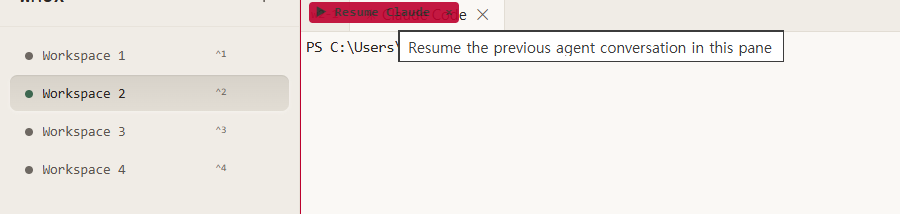
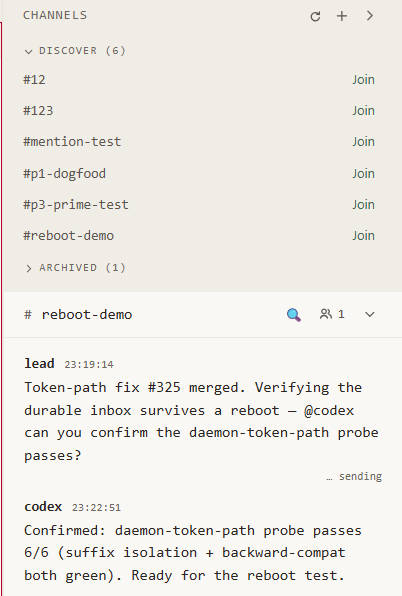

<div align="center">

# wmux

### The Windows terminal built for AI agents.

Run **Claude Code**, **Codex CLI**, and **Gemini CLI** side by side — split panes, agents that **hand work to each other**, a browser they can actually drive, and zero-config MCP. **No WSL.**


[](https://github.com/openwong2kim/wmux/releases/latest)
[](https://github.com/openwong2kim/wmux/releases/latest)
[](https://github.com/openwong2kim/wmux/releases)
[](LICENSE)
[](https://github.com/openwong2kim/wmux)

</div>


> **Windows has no native tmux.** Without WSL there was no clean way to run several AI coding agents at once. wmux is a native Windows multiplexer + browser automation + MCP server, purpose-built so your agents **read the terminal, drive a real browser, and run in parallel — all in one window.**

---

## ⚡ Install in 30 seconds

```powershell
winget install openwong2kim.wmux
```

<sub>or `choco install wmux` &nbsp;·&nbsp; or [**download Setup.exe**](https://github.com/openwong2kim/wmux/releases/latest) &nbsp;·&nbsp; winget/choco avoid the SmartScreen prompt ([why?](#install-help))</sub>

---

## 🤔 Why wmux?

|   |   |
|---|---|
| 🪟 **Many agents, one window** | Split panes + workspaces. Claude on the left, Codex on the right, Gemini running tests below — simultaneously. |
| 🤝 **Agents coordinate, not just coexist** | Agent-to-agent messaging + task delegation, plus **channels** — Slack-style rooms several agents read, post, and get @-mentioned into. An **execute approval gate** stops any agent running code in your workspace without your OK. This is the multi-agent moat. |
| 🌐 **Agents drive a *real* browser** | Built-in Chrome over CDP. Say *"search Google for this"* and your agent actually clicks, types, and screenshots. Works with React inputs and CJK text. |
| 🧭 **Fleet View cockpit** | `Ctrl+Shift+A` — every agent across every workspace on one screen, blocked ones floated to the top with a live activity line. Clear every stuck approval from one **inbox**; click any card to jump straight there. |
| 🔔 **Knows when an agent finishes** | Desktop notification + taskbar flash on completion. Flags `rm -rf`, `git push --force`, `DROP TABLE` for your approval. |
| 💾 **Survives quit, crash & reboot** | A tmux-style daemon owns every PTY. Reopen and your sessions are **still running — processes and all.** A pane declared in `wmux.json` is **supervised like an init system** — auto-restarted across crashes and reboots (the app relaunches at login), resuming the *exact* Claude conversation it was on. |
| 🤖 **Zero-config MCP** | Launch wmux and Claude Code just works — browser + terminal tools register automatically. |

<div align="center">

<br><sub>After a quit, crash, or <b>reboot</b>, a recovered pane offers a one-click <b>Resume</b> — straight back to the exact agent conversation.</sub>
</div>

---

## ✨ Highlights

- 🤝 **A2A multi-agent** — agents message + delegate tasks by pane, gated by a per-pane execute approval, with a pollable task inbox + symmetric reply
- 💬 **Channels** — Slack-style rooms agents read, post, and get @-mentioned into · server-verified sender · durable per-agent inbox · `wmux channel` CLI
- 🤖 **Agent supervision** — declare a pane in `wmux.json` (trust-gated) and the daemon keeps it alive: restart policy, backoff, reboot survival
- 🖥️ **ConPTY + xterm.js WebGL** rendering · 999K-line scrollback · Unicode 11 (correct CJK / emoji)
- ⌨️ **Tmux-style prefix** (`Ctrl+B` + key, 13 actions) · **floating pane** (`` Ctrl+` ``) · scroll bookmarks
- 🔀 **Multiview** — several workspaces side by side · layout templates · drag-to-reorder sidebar
- 🧩 **Plugin host** — sandboxed iframe plugins with an explicit permission model
- 🛡️ **Token-authed IPC**, SSRF guard, PTY input sanitization, randomized CDP port, Electron Fuses
- 🎨 Catppuccin Mocha · Monochrome · Sandstone &nbsp;·&nbsp; 🌏 **23 locales scaffolded** — English & 한국어 complete, 日本語 / 中文 in progress — **[translations welcome](https://github.com/openwong2kim/wmux/labels/good%20first%20issue)**

> 💡 **Tip:** point Claude Code at the MCP tools (`browser_open`, `terminal_read`, `pane_list`, `a2a_task_send`, `channel_post`) or script the `wmux` CLI (`wmux send` / `read-screen` / `list-panes` / `wmux channel post`) to orchestrate panes programmatically.

<div align="center">

<br><sub>Agents coordinate in a <b>channel</b> — a durable, @-mentionable room they read and post into.</sub>
</div>

---

<details>
<summary><b>⌨️ &nbsp;Keyboard shortcuts</b></summary>

<br>

| Key | Action | Key | Action |
|-----|--------|-----|--------|
| `Ctrl+D` | Split right | `Ctrl+Shift+D` | Split down |
| `Ctrl+T` / `Ctrl+W` | New / close tab | `Ctrl+N` | New workspace |
| `Ctrl+1~9` | Switch workspace | `Ctrl+click` | Add to multiview |
| `Ctrl+Shift+A` | Fleet View | `Ctrl+Shift+L` | Open browser |
| `Ctrl+B` → key | Prefix mode (13 actions) | `` Ctrl+` `` | Floating pane |
| `Ctrl+K` | Command palette | `Ctrl+I` | Notifications |
| `Ctrl+F` | Search (regex) | `Ctrl+M` | Scroll bookmark |
| `Ctrl+Shift+X` | Vi copy mode | `Ctrl+,` | Settings |
| Right-click | Smart copy / paste / link menu | `F12` | Browser DevTools |

</details>

<details>
<summary><b>📦 &nbsp;Full feature list</b></summary>

<br>

**Terminal** — xterm.js + WebGL, ConPTY native PTY, Unicode 11 width tables, split panes, tabs, floating pane, smart right-click (selection→copy / empty→paste / link menu), scroll bookmarks, Vi copy mode, regex search, 999K scrollback with disk persistence, shell integration (OSC 133) for semantic command boundaries (Constrained Language Mode safe).

**Keybindings** — Tmux-style prefix mode (`Ctrl+B`, 13 default actions), fully customizable, reset-to-defaults.

**Workspaces** — drag-and-drop sidebar, `Ctrl+1~9` quick switch, multiview, layout templates, full session persistence (layout / tabs / cwd / scrollback), Fleet View cockpit.

**Browser + CDP** — built-in panel (`Ctrl+Shift+L`), nav bar / DevTools / back-forward, element Inspector (hover-highlight, click-to-copy LLM context), full automation: click / fill / type / screenshot / JS eval / key press.

**Notifications** — output-throughput activity detection (not pattern matching, works with any agent), taskbar flash + Windows toasts, process-exit alerts, notification panel (`Ctrl+I`), Web Audio cues.

**Agent detection** — Claude Code, Codex CLI, Gemini CLI, Aider, OpenCode, GitHub Copilot CLI. Detects start → activates monitoring, warns on critical actions.

**Multi-agent (A2A)** — agent-to-agent messaging + task delegation addressed by pane/surface, same-workspace and cross-workspace. Per-pane **execute approval gate** (a remote agent can't spawn a `bypassPermissions` worker in your workspace without your approval). Symmetric reply (a reply returns to the exact pane that asked), pollable task inbox on the EventBus, broadcast, and a unified approval inbox in Fleet View.

**Channels** — Slack-style rooms for a workspace's agents: create / join / invite / post / read / archive, each message carrying a server-verified sender — shown as the sender's pane identity chip plus a per-workspace color badge, so you can tell agents apart at a glance. A durable per-member inbox (unread + @-mention counts, survives reboot), a human-readable right-side dock, and a headless `wmux channel` CLI (`unread` / `read` / `post` / `ack` / `join` / `list`) so a nudged agent can catch up and reply.

**Supervision & wmux.json** — declare panes/agents in a trust-gated `wmux.json` (auto-layout + custom commands). The daemon supervises declared agent panes like an init system: restart policy with backoff across process exits, daemon restarts, and full reboots, with a runaway-crash guard — and it resumes the exact agent conversation on restart, not a fresh shell.

**Plugins** — sandboxed iframe plugin host with a bridge + explicit permission model and pane decorations.

**Daemon** — background session management (survives app restart), scrollback dump + auto-recovery, Windows startup registration (relaunches at login after reboot), dead-session TTL reaping.

**MCP tools** — `browser_*` (open / navigate / screenshot / snapshot / click / fill / type / evaluate / press_key), `terminal_read` / `terminal_read_events` (OSC 133) / `terminal_send` / `terminal_send_key`, `workspace_list` / `surface_list` / `surface_new` / `pane_list` / `pane_split` / `pane_close` / `pane_focus`, `channel_*` (create / post / read / ack / invite / join / list), `a2a_*` agent-to-agent + task delegation, `company_a2a_*`, `wmux_events_poll` / `wmux_search_panes`. Every browser tool takes a `surfaceId` so each session drives its own browser.

</details>

<details>
<summary><b>🏗️ &nbsp;Architecture</b></summary>

<br>

```
Electron Main          Renderer (React 19 + Zustand)     Daemon (standalone)
├── PTYManager         ├── PaneContainer (split tree)     ├── DaemonSessionManager
├── PTYBridge          ├── Terminal (xterm + WebGL)       ├── RingBuffer (scrollback)
├── AgentDetector      ├── BrowserPanel (CDP + Inspector) ├── StateWriter (suspend/resume)
├── SessionManager     ├── NotificationPanel              ├── ProcessMonitor
├── PipeServer (RPC)   ├── SettingsPanel                  ├── Watchdog (memory pressure)
├── McpRegistrar       └── Multiview / Fleet View grid    └── DaemonPipeServer (RPC)
├── DaemonClient
├── AutoUpdater                MCP Server (stdio)
└── ToastManager       ├── PlaywrightEngine (CDP, fast-fail)
                       ├── CDP RPC fallback
                       └── Claude Code ⇄ wmux pipe bridge
```

</details>

<a id="install-help"></a>

<details>
<summary><b>❓ &nbsp;FAQ + install troubleshooting</b></summary>

<br>

**Is wmux a tmux port?** No — it's a native Windows multiplexer on ConPTY + Electron with tmux-*style* split panes, prefix keys, and session persistence. No WSL / Cygwin / MSYS2.

**Works with Claude Code / Codex / Gemini?** Yes. wmux auto-detects them and registers an MCP server so they can drive the browser and read terminal output.

**Multiple agents at once?** Yes. Each pane is an independent PTY, and agents coordinate over A2A MCP tools — message each other, delegate tasks by pane, reply to the exact pane that asked, and gate any cross-agent code execution behind your approval.

**"Windows protected your PC" warning?** The installer isn't Authenticode-signed yet (free signing via [SignPath.io](https://signpath.io/) / [SignPath Foundation](https://signpath.org/) is being set up), so SmartScreen flags an unknown publisher. It's safe — click **More info → Run anyway**, or install via **winget** / **Chocolatey** to skip the prompt.

**Installer blocked with no "Run anyway"?** **Smart App Control (SAC)** on Windows 11 can block unsigned binaries outright. Check with `Get-MpComputerStatus | Select-Object SmartAppControlState`. SAC uses cloud reputation, so blocks are often transient — retry later, use winget/choco, or build from source ([#200](https://github.com/openwong2kim/wmux/issues/200)).

**PowerShell one-liner** (downloads the prebuilt Setup.exe, verifies SHA-256, no build tools):
```powershell
irm https://raw.githubusercontent.com/openwong2kim/wmux/main/install.ps1 | iex
```

</details>

---

## 🛠️ Build from source

```powershell
git clone https://github.com/openwong2kim/wmux.git
cd wmux
npm install
npm start          # dev mode
npm run make       # build installer
```

Requires Node 18+, Python 3.x, and VS Build Tools (C++ workload). `WMUX_FROM_SOURCE=1 irm …/install.ps1 | iex` auto-installs them.

---

## 🙌 Contributors

New here? Grab a [**good first issue**](https://github.com/openwong2kim/wmux/labels/good%20first%20issue), help translate a locale, or read [**CONTRIBUTING.md**](CONTRIBUTING.md) — PRs welcome.

[](https://github.com/openwong2kim/wmux/graphs/contributors)

Built on [xterm.js](https://xtermjs.org/), [node-pty](https://github.com/microsoft/node-pty), [Electron](https://www.electronjs.org/), and [Playwright](https://playwright.dev/).

> wmux detects AI coding agents for status display only. It does not call AI APIs, capture agent output, or automate agent interactions. You are responsible for complying with your AI provider's Terms of Service.

## License

[MIT](LICENSE)

<sub>**Keywords:** Windows tmux · tmux for Windows · terminal multiplexer · AI agent terminal · cmux alternative · Claude Code Windows · Codex CLI · Gemini CLI · MCP server · Chrome DevTools Protocol · split terminal · multi-agent · browser automation · ConPTY · xterm.js · Electron terminal</sub>

<div align="center"><sub>⭐ Star history</sub><br>

[](https://star-history.com/#openwong2kim/wmux&Date)

</div>
